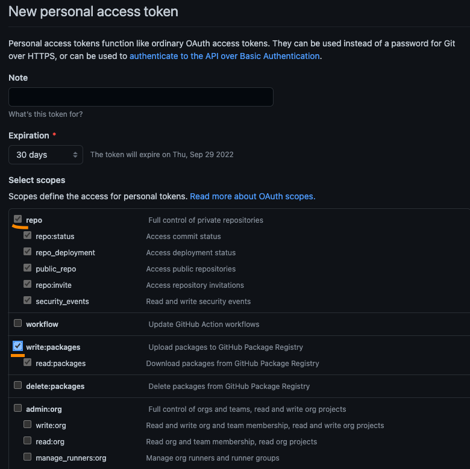

## How to download package from github packages and configure it in Maven and Gradle

Very important: you must have an account on [github](https://github.com/)

1. ### Create access token
* Open your github account and click on your icon in the upper right part of the screen and select "Settings" as on the screen below  
  
* On the left side of the screen select "Developer settings"  
  
* Select "Personal access tokens" -> "Generate new token" as on the screen below  
  
* Fill in the "note" field and select repo and write:packages as on the screen below and generate your token  
  
CONGRATULATIONS!!! You got your personal access token! Copy the value, it will be required in the future  
* Attention! Make sure to copy your personal access token. You won’t be able to see it again!
2. ### Add repository configurations in settings.xml 
* Make right-click on your module and select "Maven -> Open settings.xml" as on the screenshot  
 

* At first: insert this code in your file.  
* Insert in the "Username" field your github-username and insert your personal access token in the "password" field
  
```
  <activeProfiles>
    <activeProfile>github</activeProfile>
  </activeProfiles>

  <profiles>
    <profile>
      <id>github</id>
      <repositories>
        <repository>
          <id>central</id>
          <url>https://repo1.maven.org/maven2</url>
        </repository>
        <repository>
          <id>github</id>
          <url>https://maven.pkg.github.com/SpanningCloudApps/codestyle/tree/main/java</url>
          <snapshots>
            <enabled>true</enabled>
          </snapshots>
        </repository>
      </repositories>
    </profile>
  </profiles>

  <servers>
    <server>
      <id>github</id>
      <username>Username</username>
      <password>TOKEN</password>
    </server>
  </servers>
</settings>
```
3. ### Add dependency in your pom.xml or build.gradle
* For Maven
```
<dependency>
  <groupId>com.kaseya</groupId>
  <artifactId>static-analyzers</artifactId>
  <version>20220826114552</version>
</dependency>
```
* For Gradle
```
dependencies {
   compile group: 'com.kaseya', name: 'static-analyzers', version:'20220826114552'
}
```
4. ### Run command 
* For Maven
```
mvn install
```
* For Gradle
```
gradlew build
```